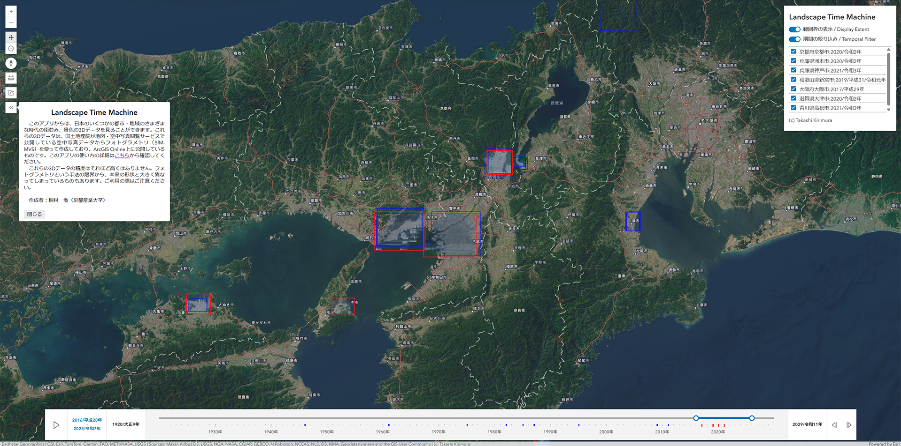

# Landscape Time Machineの使い方（作成中）

## Landscape Time Machineとは
　このアプリからは、桐村が公開しているさまざまな地域・時代の3Dデータを見ることができます。下のスライダーを使って、見たい時代を絞り込んでください。赤い範囲枠が表示されているところにズームすると、その時代の街並みや景色を3Dで確認することができます。表示している地域内でデータがある年次には、スライダー上で赤または青の目盛が付いています。赤は指定した期間中のもの、青はそれ以外のものです。地域によってはいくつかの時代の3Dデータがありますので、右上のリスト上のチェックボックスを外して表示/非表示を切り替えて、見たい地域・時代のデータを表示するようにしてください。リスト上の地域・時代をクリックすると、その場所にジャンプして、データの詳細を確認できます。

## 閲覧可能なデータの出典

## 操作方法
### 初期画面
### 期間の絞り込み
### 表示/非表示の切り替え
### 計測
### URL共有

## 使い方の例
### 1. 複数時点を切り替えながら景色を比べる
### 2. 同じ年次で違う月日の景色を切り替えて表示する
### 3. ArcGIS ProやArcGIS Onlineのシーンでレイヤーを読み込む

## いろいろな限界について
これらの3Dデータは、国土地理院が地図・空中写真閲覧サービスで公開している空中写真をもとにして作成したものです。精度はそれほど高くはありませんので、実際とは大きく景色が異なることもあります。ご利用の際はご注意ください。

## 作成者について
桐村　喬（京都産業大学）
