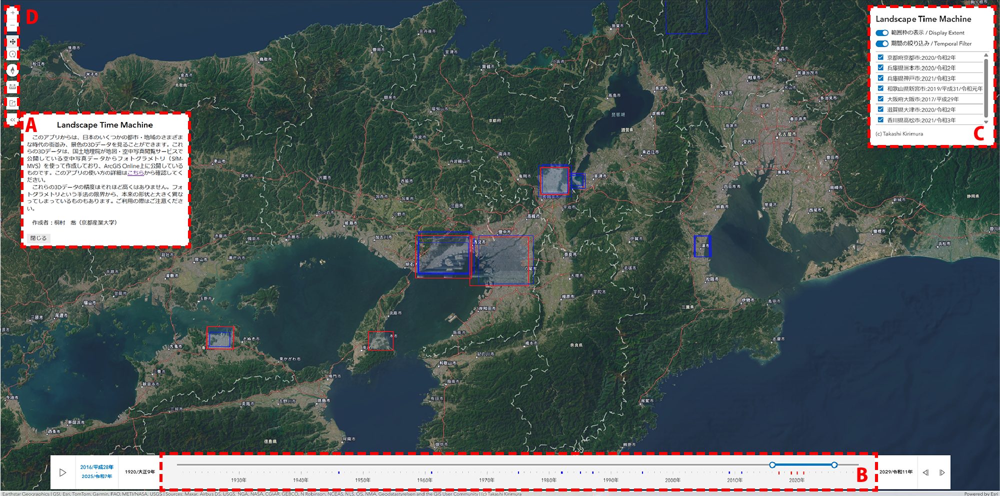

# Landscape Time Machineの使い方（作成中）

## Landscape Time Machineとは
　このアプリからは、日本のいくつかの都市・地域のさまざまな時代の街並み、景色の3Dデータを見ることができます。これらの3Dデータは、国土地理院が地図・空中写真閲覧サービスで公開している空中写真データからフォトグラメトリ（SfM-MVS技術）を使って作成しており、ArcGIS Online上に公開しているものです。

## データの出典
　3Dデータは、国土地理院の[地図・空中写真閲覧サービス](https://mapps.gsi.go.jp/maplibSearch.do#1)で公開されている、400dpiの空中写真を用いて作成しています。このアプリ自体は、[ArcGIS Maps SDK for JavaScript](https://developers.arcgis.com/javascript/latest/)と、[Calcite Design System](https://developers.arcgis.com/calcite-design-system/)を使用して作成しています。

## 操作方法
### 初期画面

#### A. このアプリについて
　このアプリの説明が表示されています。「閉じる」ボタンか、ESCキーで閉じることができます。
#### B. 期間の絞り込みスライダー
　画面に表示する、3Dデータの期間を指定するためのスライダーです。Cの操作パネルで「期間の絞り込み」がオンのときに有効になります。スライダー上の赤い目盛は、現在表示している地域内で、3Dデータがある年次を示しています。青い目盛は、スライダーの期間の範囲外の3Dデータがある年次を示します。3Dマップ内でも、赤い範囲枠が赤い目盛の3Dデータの範囲を、青い範囲枠が青い目盛の3Dデータの範囲をそれぞれ示しています。
#### C. 操作パネル
　赤・青の範囲枠の表示／非表示の切り替えと、期間の絞り込みスライダーの有効／無効の切り替えボタンがあり、現在表示している地域内で、スライダーの期間中の3Dデータの一覧も表示されます。3Dデータの一覧のチェックボックスをオフにすると、3Dマップ上でその3Dデータが非表示になります。また、リスト上の3Dデータの名前（地域・年次）をクリックすると、3Dデータの範囲にズームし、3Dデータの詳細を示したポップアップが表示されます。
#### D. ツール
　　

下のスライダーを使って、見たい時代を絞り込んでください。赤い範囲枠が表示されているところにズームすると、その時代の街並みや景色を3Dで確認することができます。表示している地域内でデータがある年次には、スライダー上で赤または青の目盛が付いています。赤は指定した期間中のもの、青はそれ以外のものです。地域によってはいくつかの時代の3Dデータがありますので、右上のリスト上のチェックボックスを外して表示/非表示を切り替えて、見たい地域・時代のデータを表示するようにしてください。リスト上の地域・時代をクリックすると、その場所にジャンプして、データの詳細を確認できます。
### 期間の絞り込み
### 表示/非表示の切り替え
### 計測
### URL共有

## 使い方の例
### 1. 複数時点を切り替えながら景色を比べる
### 2. 同じ年次で違う月日の景色を切り替えて表示する
### 3. ArcGIS ProやArcGIS Onlineのシーンでレイヤーを読み込む

## いろいろな限界について
これらの3Dデータは、国土地理院が地図・空中写真閲覧サービスで公開している空中写真をもとにして作成したものです。精度はそれほど高くはありませんので、実際とは大きく景色が異なることもあります。ご利用の際はご注意ください。

## 作成者について
桐村　喬（京都産業大学）
