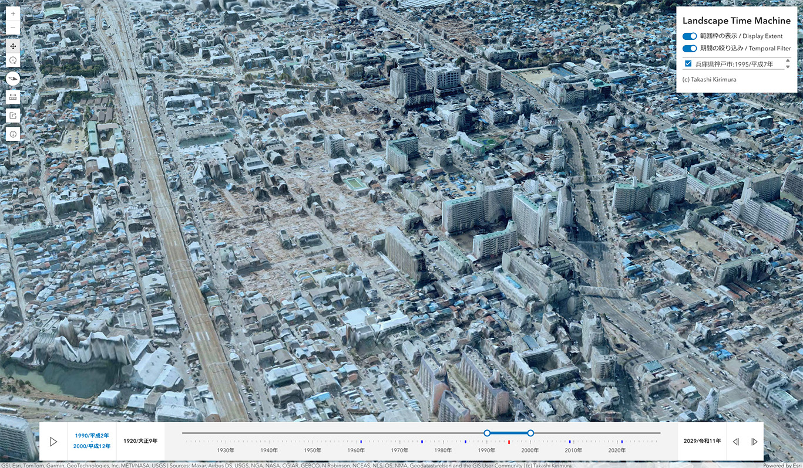
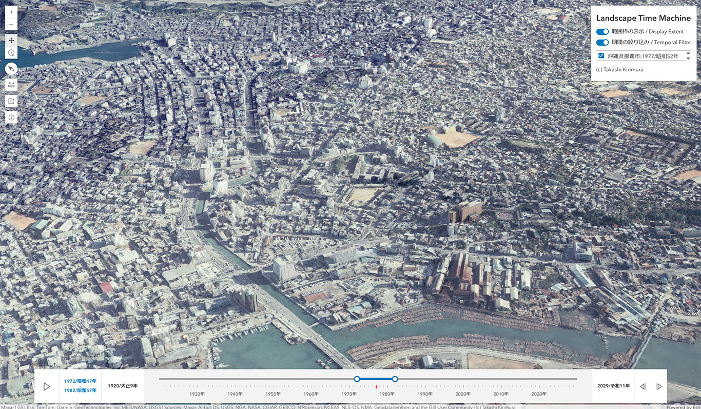
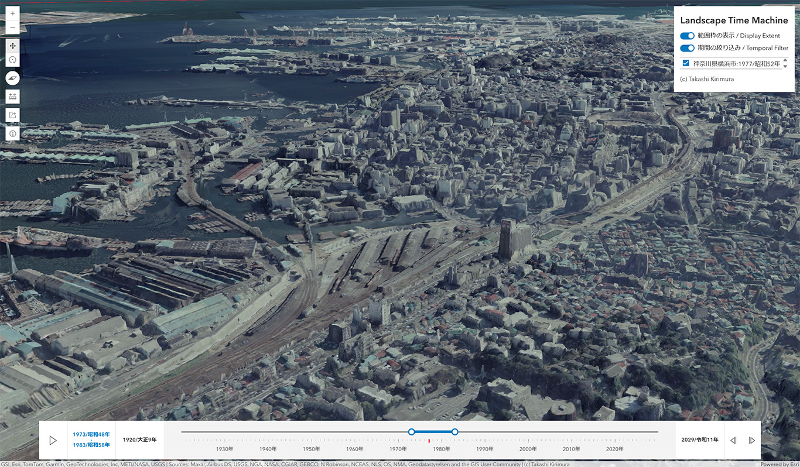
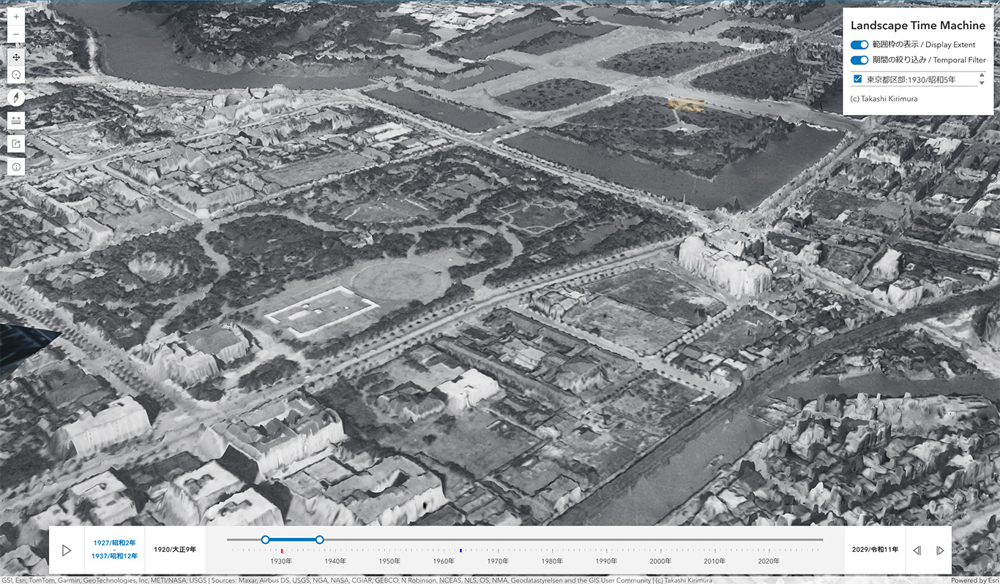
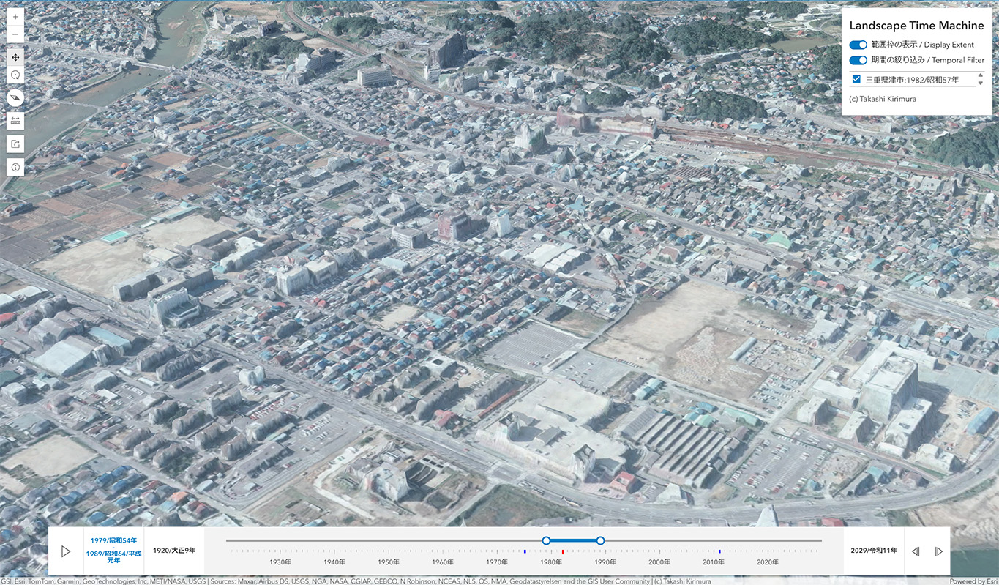
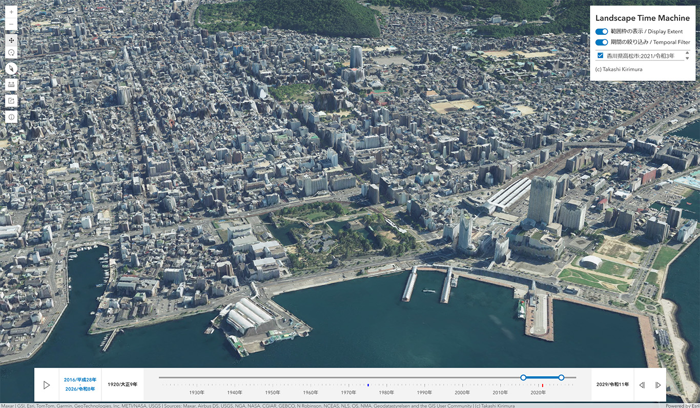

# Landscape Time Machine

1975年の大阪駅周辺の3D ([Landscape Time Machineで見る](https://tkirimura.github.io/3dviewer/ltm/landscapetimemachine.html?x=15084108.72&y=4125934.27&z=1200.91&h=196.90&t=58.59&from=1970-01-01&to=1979-12-31))
## Landscape Time Machineとは
　このアプリからは、日本のいくつかの都市・地域のさまざまな時代の街並み、景色の3Dデータを見ることができます。これらの3Dデータは、国土地理院が地図・空中写真閲覧サービスで公開している空中写真データからフォトグラメトリ（SfM-MVS）を使って作成しており、ArcGIS Online上に公開しているものです。

## データの出典
　3Dデータは、国土地理院の[地図・空中写真閲覧サービス](https://service.gsi.go.jp/map-photos/app/map?search=photo)で公開されている、400dpiの空中写真を用いて作成しています。このアプリ自体は、[ArcGIS Maps SDK for JavaScript](https://developers.arcgis.com/javascript/latest/)と、[Calcite Design System](https://developers.arcgis.com/calcite-design-system/)を使用して作成しています。

## 操作方法
　こちらからアクセスできます。 [Landscape Time Machine](https://tkirimura.github.io/3dviewer/ltm/landscapetimemachine.html)
### 初期画面

#### A. このアプリについて
　このアプリの説明が表示されています。「閉じる」ボタンか、ESCキーで閉じることができます。
#### B. 期間の絞り込みスライダー
　画面に表示する、3Dデータの期間を指定するためのスライダーです。Cの操作パネルで「期間の絞り込み」がオンのときに有効になります。スライダー上の赤い目盛は、現在表示している地域内で、3Dデータがある年次を示しています。青い目盛は、スライダーの期間の範囲外の3Dデータがある年次を示します。3Dマップ内でも、赤い範囲枠が赤い目盛の3Dデータの範囲を、青い範囲枠が青い目盛の3Dデータの範囲をそれぞれ示しています。
#### C. 操作パネル
　赤・青の範囲枠の表示／非表示の切り替えと、期間の絞り込みスライダーの有効／無効の切り替えボタンがあり、現在表示している地域内で、スライダーの期間中の3Dデータの一覧も表示されます。3Dデータの一覧のチェックボックスをオフにすると、3Dマップ上でその3Dデータが非表示になります。また、リスト上の3Dデータの名前（地域・年次）をクリックすると、3Dデータの範囲にズームし、3Dデータの詳細を示したポップアップが表示されます。
#### D. ツール
 3Dマップの表示範囲を拡大（ズームイン）します。マウスのホイールでも操作できます。\
 3Dマップの表示範囲を縮小（ズームアウト）します。マウスのホイールでも操作できます。\
 3Dマップの操作モードを画面移動主体に変更します。ここで切り替えることで、マウスの左右のドラッグ時の動きも変わります。初期表示ではこちらのモードです。\
 3Dマップの操作モードを回転主体に変更します。ここで切り替えることで、マウスの左右のドラッグ時の動きも変わります。\
 北向きになるように向きをリセットします。\
 3Dマップ上で、高さや距離を計測するためのツールを表示します。\
 現在の表示範囲、表示期間を示すURLを表示します。ここで表示されたURLを使用すると、特定の景色を初期表示させることができます（範囲枠の表示／非表示、操作パネルでの3Dデータの表示／非表示は反映されません）。\
 このアプリについての説明画面を表示します。

### 3Dマップの操作
　パソコンであれば、ツールを使い分けるよりも、マウスで操作するほうが操作しやすいです。ホイールで拡大／縮小ができます。「画面移動」の操作モードの場合、マウスで左ドラッグをすると、表示範囲を移動できます。右ドラッグをすると、視点の向きや方向を変えることができます。「回転」の操作モードの場合、ドラッグの左右が反転します。

## 便利な使い方
### 1. 複数時点を切り替えながら景色を比べる
　期間の絞り込みスライダーで期間を変えていけば、複数の時点の3Dデータを表示することができますが、切り替えはあまりスムーズではありません。ワンタッチで切り替えできるようにするには、操作パネルのチェックボックスのオン／オフを使うとよいでしょう。そのためには、期間の絞り込みスライダーで、表示したいすべての年次が含まれるように範囲を広げます。そのうえで、操作パネルのチェックボックスのオン／オフを切り替えれば、複数時点を切り替えながら景色の変化を観察することができます。
### 2. 同じ年次で違う月日の景色を切り替えて表示する
　一部の3Dデータには、同じ年次であるものの、別の月日に撮影された空中写真から作成した複数の3Dデータがあることがあります（2025年3月時点では、能登半島地震に関連して作成した3Dデータのみです）。その場合、期間の絞り込みスライダーで絞り込んでも、複数の3Dデータが重なってしまい、見づらくなります。1の使い方を参考に、操作パネルのチェックボックスのオン／オフで切り替えることで、どちらか一方の3Dデータを表示することができます。なお、これらの3Dデータの詳細情報については、ポップアップや、そこに表示されているレイヤー名をクリックして表示されるページを確認してください。
### 3. ArcGIS ProやArcGIS Onlineのシーンでレイヤーを読み込む
　操作パネルのリストをクリックして表示されるポップアップには、3Dデータの詳細が表示されます。このなかに含まれるレイヤー名の情報を使うことで、ArcGIS ProやArcGIS Onlineのシーンで当該レイヤーを読み込むことができます。

## 利用上の注意
　これらの3Dデータの精度はそれほど高くはありません。タワー状の建物などは表示されていない場合がありますし、実際の形状とは大きく異なることがあります。また、グラウンドやソーラーパネル、水面など、フォトグラメトリという手法の限界から、本来の形状と大きく異なってしまっているものもあります。その時点で実際に見えた景色かどうかはわかりません。ご利用の際はご注意ください。

## 作成者について
桐村　喬（京都産業大学） [X(Twitter)](https://x.com/tkirimura)

## ギャラリー

1995年の神戸市長田区御蔵通周辺 ([Landscape Time Machineで見る](https://tkirimura.github.io/3dviewer/ltm/landscapetimemachine.html?x=15046566.15&y=4118814.22&z=501.69&h=257.63&t=60.89&from=1990-01-01&to=2000-12-31))

1977年の那覇市 ([Landscape Time Machineで見る](https://tkirimura.github.io/3dviewer/ltm/landscapetimemachine.html?x=14211704.33&y=3024066.76&z=942.31&h=50.28&t=61.31&from=1972-01-01&to=1982-12-31))

1977年の横浜市 ([Landscape Time Machineで見る](https://tkirimura.github.io/3dviewer/ltm/landscapetimemachine.html?x=15542339.88&y=4225854.92&z=404.41&h=109.85&t=72.69&from=1973-01-01&to=1983-12-31))

1930年ごろの日比谷公園 ([Landscape Time Machineで見る](https://tkirimura.github.io/3dviewer/ltm/landscapetimemachine.html?x=15558081.91&y=4254710.09&z=435.04&h=342.24&t=64.01&from=1927-01-01&to=1937-12-31))

1982年の津市 ([Landscape Time Machineで見る](https://tkirimura.github.io/3dviewer/ltm/landscapetimemachine.html?x=15198085.36&y=4128422.73&z=510.64&h=243.22&t=63.58&from=1979-01-01&to=1989-12-31))

2021年の高松市 ([Landscape Time Machineで見る](https://tkirimura.github.io/3dviewer/ltm/landscapetimemachine.html?x=14923424.63&y=4077639.00&z=849.93&h=209.75&t=64.48&from=2016-01-01&to=2026-12-31))
