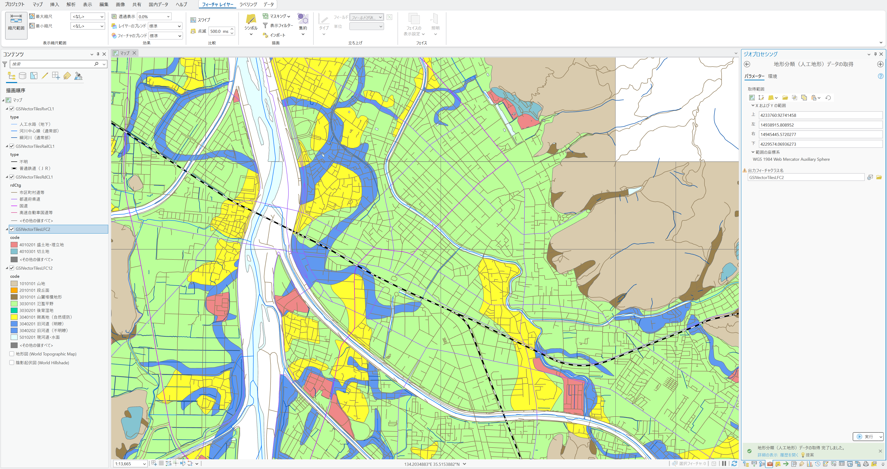

# ArcGIS Pro用ツール

## 地理院ベクトルタイルデータの取得 (GSIVectorTiles.pyt)
国土地理院が[ベクトルタイル提供実験](https://github.com/gsi-cyberjapan/vector-tile-experiment)で公開している、道路中心線、鉄道中心線、河川中心線のデータ（ズームレベル16）、地形分類（自然地形・人工地形）のデータ（ズームレベル14）をダウンロードする、ArcGIS Pro用のツールです。

**1/12更新 地形分類データも取得できるようにしました。**

### 使い方
1. GSIVectorTiles.pytを[ダウンロード](GSIVectorTiles.pyt)して、プロジェクトのフォルダに保存します。

2. ArcGIS Proを起動して、カタログウィンドウを表示し、「フォルダー」のプロジェクトのフォルダ内にある、「GSIVectorTiles.pyt」をダブルクリックします。

3. 「このツールボックスのコードを実行することを許可しますか？」と表示されますので、「はい」をクリックします。

4. 「河川中心線データの取得」、「鉄道中心線データの取得」、「道路中心線データの取得」、「地形分類（自然地形）データの取得」、「地形分類（人工地形）データの取得」の5つのツールが表示されますので、必要なツールをダブルクリックして実行してください。

5. どのツールも、実行する際には取得範囲と出力フィーチャクラス名を指定する必要があります。現在の表示範囲や範囲を描画して設定することができます。取得に成功すれば、出力結果がマップに追加されます。

### 注意点
- エラーが発生して処理が終わってしまうことがあります。大規模に取得する場合はいくつかの地域で試してから実行するか、小分けにしてください。
- GeoJSONをダウンロードして処理しますが、ダウンロードしたファイルは最後に削除されます（最後のフィーチャクラスへの変換時に、プロジェクトのフォルダ内に一時的にファイルとして保存されます）。
- 国土地理院のサーバー側の状態やネットワークの状態によって、データが取得できないことがあります。

### 地形分類（自然地形・人工地形）のcodeの値
- 地形分類のデータのcodeフィールド（属性コード）の値については、[こちら](https://www.gsi.go.jp/bousaichiri/bousaichiri41017.html)に説明があります。

(c) Takashi Kirimura
