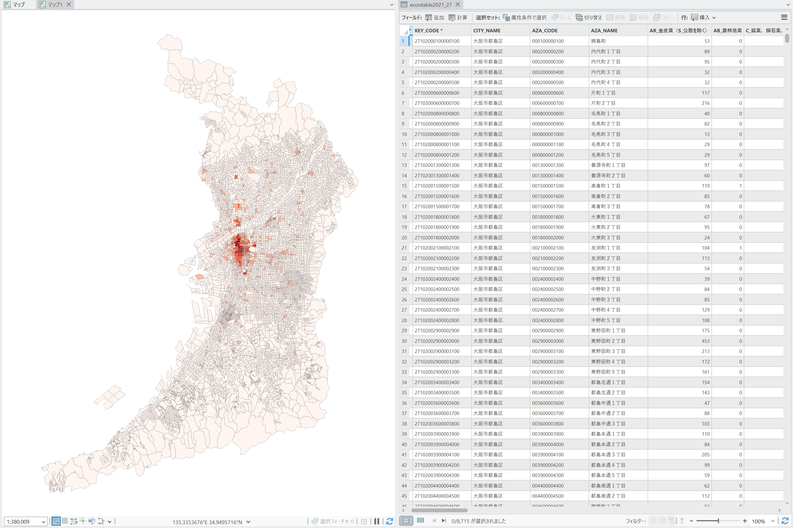

# ArcGIS Pro用ツール

## e-Statデータの変換 (eStatTools.pyt)
e-Statの[統計地理情報システム](https://www.e-stat.go.jp/gis)で公開されている、境界データをフィーチャクラスに、統計データをテーブルに、それぞれ変換する、ArcGIS Pro用のツールです。**ウェブサイトからダウンロードしたZIPファイルを展開せずに変換**することができます。

### 使い方
1. eStatTools.pytを[ダウンロード](eStatTools.pyt)して、プロジェクトのフォルダに保存します。

2. ArcGIS Proを起動して、カタログウィンドウを表示し、「フォルダー」のプロジェクトのフォルダ内にある、「eStatTools.pyt」をダブルクリックします。

3. 「このツールボックスのコードを実行することを許可しますか？」と表示されますので、「はい」をクリックします。

4. 「e-Stat境界データの変換」と「e-Stat統計データの変換」という2つのツールが表示されますので、必要なツールをダブルクリックして実行してください。

#### e-Stat境界データの変換
- ダウンロードしたZIPファイルに含まれている**小地域のShapefile形式の境界データ**を、展開せずにフィーチャクラスに変換し、マップに出力結果を追加します。
- KEY_CODEや町丁名などのフィールドを基準に、AREA（面積）などのフィールドの値を合計する形でディゾルブすることもできます（オプション）。
- 国勢調査の町丁・字等のデータに限り、出力結果から水面調査区を除外することができます（オプション）。

#### e-Stat統計データの変換
- ダウンロードしたZIPファイルに含まれている統計データを、展開せずにテーブルに変換し、マップに出力結果を追加します。
- e-Statの統計データにみられる、2行目の日本語のフィールド名はエイリアスとして利用されます。

### 注意点
- エラーが発生するかもしれません。なるべく早く対応しますが、時間がかかるかもしれません。
- 境界データの変換ツールは、プロジェクトのフォルダ内で一時的にShapeファイルを展開します。
- ZIPファイルを入れ違いにしないように気を付けてください（統計データの変換ツールに境界データのZIPファイルを読み込むなど）。統計データのZIPファイルは、通常、tblで始まるファイル名です。

(c) Takashi Kirimura
