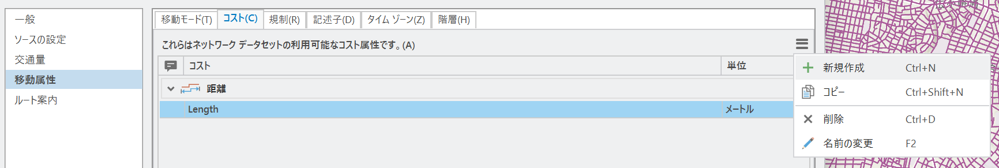

## 道路中心線データを使ったArcGIS Pro用ネットワークデータセットの作り方
国土地理院のベクトルタイル提供実験の道路中心線データからは、**ネットワーク分析**（拙著『[ArcGIS Proではじめる地理空間データ分析](https://www.kokon.co.jp/book/b642158.html)』（以下、テキストと呼びます）参照）を行うための簡易的なネットワークデータセットを作成・構築することができます。本格的なネットワーク分析を行うためには、方向などの属性がある道路データが必要になりますが、ここでは道路中心線データによるシンプルな方法について解説します。

### ポイント
- ネットワークデータセットを作成するためには、道路の区間ごとに、移動手段（**モード**）別の所要時間（**コスト**）を計算しておく必要があります。自動車では何分、徒歩では何分といった具合です。
- 石段のように、自動車では通れないような道路もありますので、そうした道路は通行できないことがわかるような「**規制**」についてのフィールドも追加する必要があります。
- ここでは、**テキスト20章**と同様のデータを作成することを目的に、以下のように**自動車と徒歩という2種類の移動手段**を設定します。

#### 自動車モード
高速道路や幅員が広い道路ほど速くなるようにします。具体的には以下のように設定しました。通行不可とするのは、庭園路と石段と徒歩道です。時速については例なので、それぞれ適切と考えられるものを設定してください。

|条件|速度|
|:---|:---|
|rdCtgが'高速自動車国道等'であるもの|時速80km|
|rdCtgが'高速自動車国道等'ではなく、rnkWidthが'19.5m以上'であるもの|時速40km|
|rdCtgが'高速自動車国道等'ではなく、typeが'通常部'で、rnkWidthが'5.5m-13m未満'または'13m-19.5m未満'であるもの|時速30km|
|rdCtgが'高速自動車国道等'ではなく、typeが'通常部'で、rnkWidthが'3m-5.5m未満'であるもの|時速20km|
|rdCtgが'高速自動車国道等'ではなく、typeが'通常部'で、rnkWidthが'3m未満'または'不明'であるもの|時速15km|
|rdCtgが'高速自動車国道等'ではなく、typeが'通常部'ではないもの（＝庭園路、石段、徒歩道）|通行不可|

#### 徒歩モード
高速道路については通れないものとし、石段なども早くは歩けないものとしました。庭園路は遅くしなくてもよいかもしれません。

|条件|速度|
|:---|:---|
|rdCtgが'高速自動車国道等'であるもの|通行不可|
|rdCtgが'高速自動車国道等'ではなく、typeが'通常部'であるもの|時速4km|
|rdCtgが'高速自動車国道等'ではなく、typeが'庭園路'であるもの|時速3km|
|rdCtgが'高速自動車国道等'ではなく、typeが'徒歩道'であるもの|時速3km|
|rdCtgが'高速自動車国道等'ではなく、typeが'石段'であるもの|時速1km|

---
### 道路中心線データのダウンロードと準備
1. [地理院ベクトルタイルデータの取得](README.md)ツールを使って、必要な範囲の**道路中心線データ**をダウンロードします。
2. 「**投影変換 (Project)**」ツールで、道路中心線データを平面直角座標系などの**投影座標系に変換**します。
   - 道路中心線データは緯度経度（地理座標系）のデータなので、ラインの長さを距離としてそのまま利用することができません。そのため、投影座標系に変換しておきます。
3. 自動車モード用に、**通行の可/不可についてのフラグを入れるフィールド**を作成します（例：vehicle_YN）。
   - 数値として1と0を入れるか、文字にして、YとNを入れるかはどちらでもOKです。
   - 最初に、どのレコードも選択していない状態で、フィールド演算を行い、デフォルトの値として0（またはN）を入れておきます。
4. 上記の自動車モードの条件に従って、属性条件で選択しながら、フィールド演算で通行可能なところに1（またはY）を設定します。
5. 自動車モード用の**コスト（所要時間）のフィールド**を作成します（例：vehicle_minute）。
   - 型はDoubleとします。単位としては分というつもりです。
6. 上記の自動車モードの条件に従って、属性条件で選択しながら、フィールド演算で所要時間を計算します。Shape_Lengthという長さのフィールド（単位：メートル）を使いつつ、メートル単位の分速（時速4kmなら4000/60）で長さを割って計算します。
7. 3～6の手順で、徒歩モードについても必要なフィールドを作成し、計算していきます。

---
### ネットワークデータセットの作成
1. ネットワークデータセットを作成するファイルジオデータベース内に、**フィーチャデータセットを作成**します。カタログウィンドウで、ファイルジオデータベースを右クリックし、「新規」⇒「フィーチャデータセット」の順にクリックしてください。座標系は道路中心線で設定した投影座標系にしましょう。
2. カタログウィンドウで、作成したフィーチャデータセット内に、**投影座標系に変換した道路中心線データを移動**（またはコピー）させます。
3. 「**ネットワークデータセットの作成 (Create Network Dataset)**」ツールを使って、作成したフィーチャデータセットをもとに、新しくネットワークデータセットを作成します。
   - "ターゲットフィーチャデータセット"は作成したフィーチャデータセット、"ネットワークデータセット名"は任意の名前、"ソースフィーチャクラス"は道路中心線データを選び、"高度モデル"は"高度フィールド"のままにして「実行」します。
4. 作成に成功すると、マップにネットワークデータセットが追加されますので、一度マップから削除します。
   - マップに追加されている状態では、設定の変更ができないためです。
5. カタログウィンドウで、作成されたネットワークデータセットを右クリックして「プロパティ」を表示します。**ネットワークデータセットのプロパティで、モード別の設定を行います**。
6. 「**移動属性**」をクリックし、「**コスト**」タブを開いて、画面右の三本線のメニューボタンをクリックし、「**新規作成**」をクリックします。
   
   - "時間"カテゴリの新しいコストが作成されますので、名前を「**所要時間（自動車）**」とします。
7. エバリュエーターのエッジ欄を確認し、順方向となっている行のタイプを「フィールド スクリプト」に変更したうえで、値欄をクリックして、"x"（フィールド スクリプトの設定ボタン）をクリックし、フィールドの一覧から、道路中心線データの5で設定した自動車モード用のコストフィールドをダブルクリックして「OK」をクリックして閉じます。
8. 6・7の手順で、徒歩モード用のコストを作成してください。
9. 「**規制**」タブをクリックし、同じように「**新規作成**」をメニューからクリックして、「**自動車通行不可**」という名前に変更します。
10. エバリュエーターについても同様に、タイプを「フィールド スクリプト」に変更し、禁止欄に「!vehicle_YN! == 0」のように設定します。
   - コストと同様に、フィールドスクリプトを設定しますが、こちらでは条件式を入力します。フィールドの一覧から通行可/不可のフィールドをダブルクリックし、半角スペースを空けて、「 == 0」と半角で入力します。
11. 徒歩についても同じように「規制」を作成してください。
12. 「**移動モード**」タブで、新規作成を行い、名称を「**自動車**」にします。
   - タイプは「運転」、インピーダンスは「所要時間（自動車）」を選び、規制は「自動車通行不可」にチェックを入れます。
13. 同じように「徒歩」の移動モードを作成してください（タイプは「徒歩」になります）。
14. コスト、規制、移動モードの設定が終われば、「OK」をクリックして、プロパティを閉じます。
15. 「**ネットワークの構築 (Build Network)**」ツールを起動して、ネットワークデータセットを選び、「実行」をクリックします。
   - 警告が表示されるかもしれませんが、実際に使ってみてあまり問題がなければ無視しても構いません。

---
### ネットワーク分析の実行
ネットワークデータセットとして再びマップに追加されているはずですので、ネットワーク分析を実行してみてください。詳細な方法はテキスト20章を確認してください。

Takashi Kirimura
