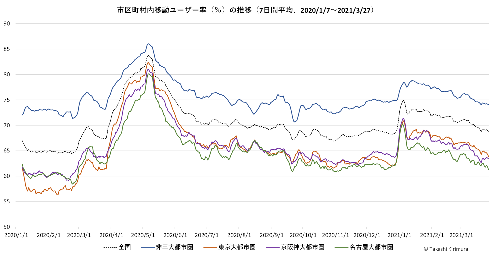

## ジオタグ付きツイートデータの分析結果等の置き場

### 三大都市圏の市区町村内移動ユーザー率
 2021/03/27までの値
大都市圏は2015年の国勢調査結果に基づくもの。

### 刊行物、関連論文等
[ツイッターの空間分析](http://www.kokon.co.jp/book/b481378.html) 古今書院、2019。好評発売中です。
[位置情報付きTwitterデータの観光行動分析への有用性と限界 : 伊勢志摩地域における事例分析を通して](http://id.nii.ac.jp/1543/00000083/) 皇學館大学紀要56、2018。
[ツイッターデータからみたCOVID-19の感染拡大にともなう「行動変容」の地理的特徴](http://www.kokon.co.jp/book/b516912.html) 地理65-7、2020。

