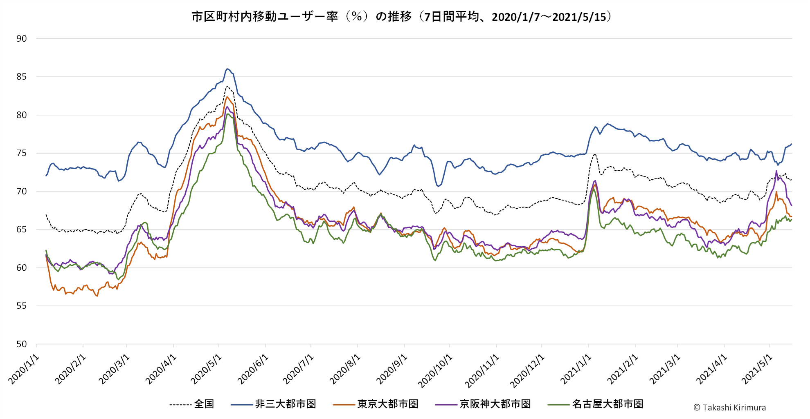

## ジオタグ付きツイートデータの分析

画像については、出典を明示したうえで適宜ご活用ください。ただし、他サイト等への転載を希望される場合はお知らせください。連絡先をご存じない場合は[連絡フォーム](https://forms.gle/cYD8dgG7f7S6oHnL9)をご利用ください。

### 三大都市圏の市区町村内移動ユーザー率（不定期更新）
 2021/05/15までの値

 2021/05/15までの値

大都市圏は2015年の国勢調査結果に基づくものです。ただし、名称は一般的に用いられる東京大都市圏（＝関東大都市圏）、京阪神大都市圏（＝近畿大都市圏）、名古屋大都市圏（＝中京大都市圏）としています。
計算方法については下記の4の論文を参照してください。

### 刊行物、関連論文、サイト等（順次載せていきます）
1. [ツイッターの空間分析](http://www.kokon.co.jp/book/b481378.html) 古今書院、2019。好評発売中です。

2. [位置情報付きTwitterデータの観光行動分析への有用性と限界 : 伊勢志摩地域における事例分析を通して](http://id.nii.ac.jp/1543/00000083/) 皇學館大学紀要56、2018。

3. [ツイッターデータからみたCOVID-19の感染拡大にともなう「行動変容」の地理的特徴](http://www.kokon.co.jp/book/b516912.html) 地理65-7、2020。

4. [人々の移動状況に関する時系列データとしての位置情報付きTwitterデータの活用](https://drive.google.com/file/d/1zQtEd5c0u7-4Rck_vs_z3LVDkj9q1Sah/view?usp=sharing) 地理情報システム学会講演論文集29、2020。

5. [Twitterユーザーの1日単位の市区町村内移動ユーザー率マップ](https://arcg.is/1azvWS) 2020年公開。

6. [10+1 website WebGIS・SNS・ビッグデータが描く都市の諸相](https://www.10plus1.jp/monthly/2016/11/issue-03.php) 2016年公開。

7. [全国レベルでみたジオタグ付きツイートに用いられる地名の空間分布](http://www.csis.u-tokyo.ac.jp/wp-content/uploads/2020/12/days20D12.pdf) CSIS DAYS 2020研究アブストラクト集、2020。（藤原氏、平岡氏との共同発表）

8. [ ジオタグ付きツイートで用いられる名詞の空間分布](http://www.csis.u-tokyo.ac.jp/wp-content/uploads/2019/11/days19D08.pdf) CSIS DAYS 2019研究アブストラクト集、2019。（藤原氏、平岡氏との共同発表）
